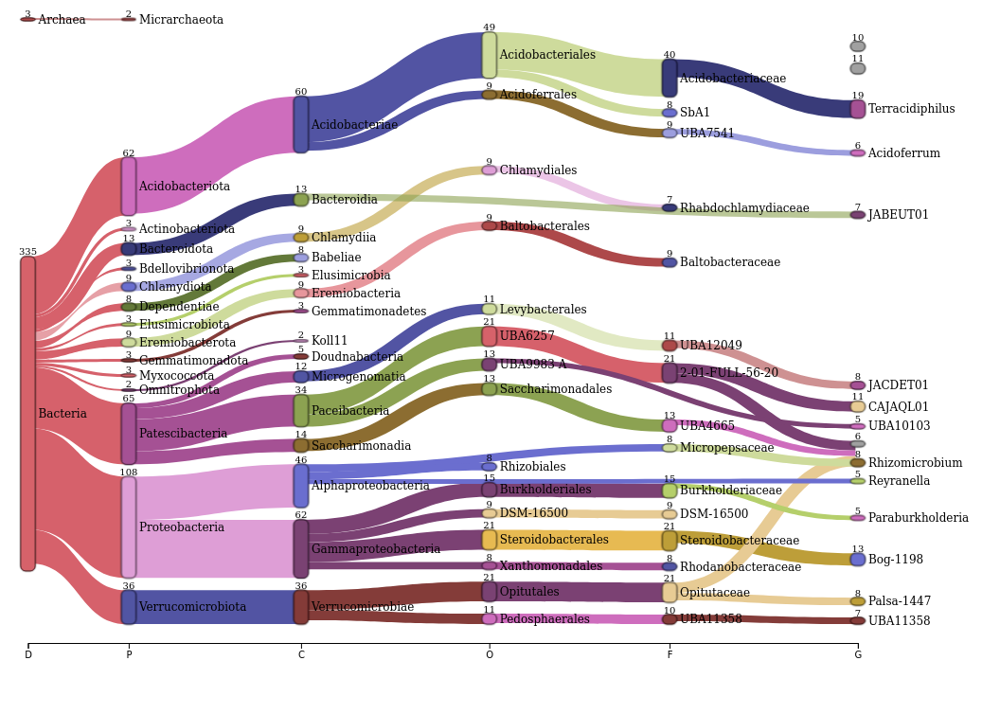
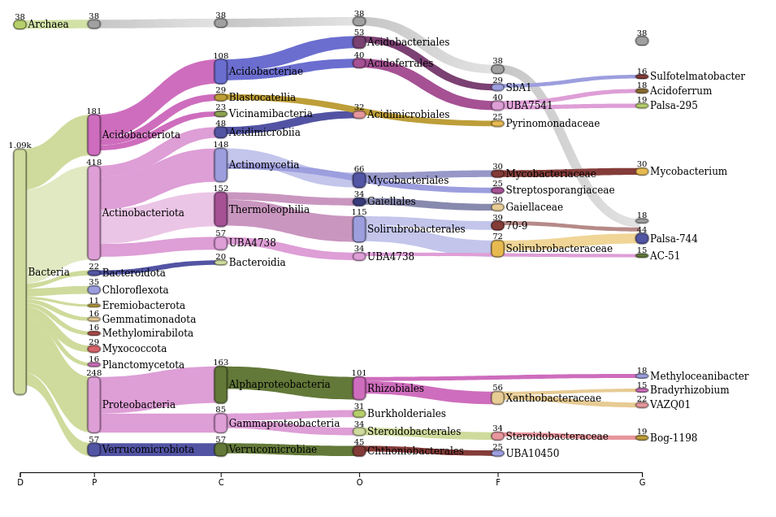

```{r}
library(tidyverse)
```

# Pavian Sankey Plot

* [Pavian Github](https://github.com/fbreitwieser/pavian)
* Upload the resulting file to [Pavian Shiny](https://fbreitwieser.shinyapps.io/pavian/)
* Generate html report
* Click on Sample then Configure sankey
* Adjust the graph and the save network
* Caitlin Singleton used a html to svg converter (https://www.hiqpdf.com/demo/ConvertHtmlToSvg.aspx) with aesthetic tweaks in inkscape. 

## Make input for for Pavian Sankey Plot (from GTDB format)

```{r}
NEB_coassembly_GTDB <- read_tsv("checkm_gtdb_NEB_coassembly_2.5k.tsv")  %>% 
  select("classification") %>% 
  mutate_at("classification", str_replace_all, ";", "\\|") 

NEB_coassembly_GTDB_s <- NEB_coassembly_GTDB
NEB_coassembly_GTDB_g <- NEB_coassembly_GTDB
NEB_coassembly_GTDB_f <- NEB_coassembly_GTDB
NEB_coassembly_GTDB_o <- NEB_coassembly_GTDB
NEB_coassembly_GTDB_c <- NEB_coassembly_GTDB
NEB_coassembly_GTDB_p <- NEB_coassembly_GTDB
NEB_coassembly_GTDB_d <- NEB_coassembly_GTDB

NEB_coassembly_GTDB_g$classification <- sub("\\|s__.*", "", NEB_coassembly_GTDB_g$classification)  
NEB_coassembly_GTDB_f$classification <- sub("\\|g__.*", "", NEB_coassembly_GTDB_f$classification)  
NEB_coassembly_GTDB_o$classification <- sub("\\|f__.*", "", NEB_coassembly_GTDB_o$classification)  
NEB_coassembly_GTDB_c$classification <- sub("\\|o__.*", "", NEB_coassembly_GTDB_c$classification)  
NEB_coassembly_GTDB_p$classification <- sub("\\|c__.*", "", NEB_coassembly_GTDB_p$classification)  
NEB_coassembly_GTDB_d$classification <- sub("\\|p__.*", "", NEB_coassembly_GTDB_d$classification)  

NEB_coassembly_GTDB_allTaxa <- bind_rows(NEB_coassembly_GTDB_s, NEB_coassembly_GTDB_g, NEB_coassembly_GTDB_f, NEB_coassembly_GTDB_o, NEB_coassembly_GTDB_c, NEB_coassembly_GTDB_p, NEB_coassembly_GTDB_d) %>% 
  mutate(classification = as.factor(classification)) %>% 
  count(classification) %>% 
# rename for Pavian format
  rename(`#SampleID` = `classification`) %>% 
  rename(`Metaphlan2_Analysis` = `n`) 
```

```{r}
write_tsv(NEB_coassembly_GTDB_allTaxa, "NEB_coassembly_GTDB_pavian.txt")
```

[Interactive HTML file with Pavian Sankey Plot for NEB filter metagenomes](sankey-NEB_coassembly_GTDB_pavian.html)




## Make input for for Pavian Sankey Plot (from IMG format for GTDB taxonomy


```{r}
neon_jgi_pilot_ind_GTDB <- read_csv("neon-jgi_pilot_ind_assembly_bins.csv") %>% 
  select(`GTDB-Tk Taxonomy Lineage`) %>% 
  # NAs are likely Archaea
  replace_na(list(`GTDB-Tk Taxonomy Lineage` = 'Archaea')) %>% 
  # Pavian format requires p__ etc
  separate(`GTDB-Tk Taxonomy Lineage`, c("Domain", "Phylum", "Class", "Order", "Family", "Genus", "Species"), "; ") %>% 
  unite(col = "classification", c(Domain, Phylum, Class, Order, Family, Genus, Species), sep='; ') %>% 
  mutate_at("classification", str_replace, "Archaea", "d__Archaea") %>% 
  mutate_at("classification", str_replace, "Bacteria", "d__Bacteria") %>%  
  mutate_at("classification", str_replace, "; ", "|p__") %>% 
  mutate_at("classification", str_replace, "; ", "|c__") %>% 
  mutate_at("classification", str_replace, "; ", "|o__") %>% 
  mutate_at("classification", str_replace, "; ", "|f__") %>% 
  mutate_at("classification", str_replace, "; ", "|g__") %>% 
  mutate_at("classification", str_replace, "; ", "|s__") %>% 
  mutate_at("classification", str_replace_all, "NA", "") 
  

# Create format for Pavian with counts for each taxonomic level
neon_jgi_pilot_ind_GTDB_s <- neon_jgi_pilot_ind_GTDB
neon_jgi_pilot_ind_GTDB_g <- neon_jgi_pilot_ind_GTDB
neon_jgi_pilot_ind_GTDB_f <- neon_jgi_pilot_ind_GTDB
neon_jgi_pilot_ind_GTDB_o <- neon_jgi_pilot_ind_GTDB
neon_jgi_pilot_ind_GTDB_c <- neon_jgi_pilot_ind_GTDB
neon_jgi_pilot_ind_GTDB_p <- neon_jgi_pilot_ind_GTDB
neon_jgi_pilot_ind_GTDB_d <- neon_jgi_pilot_ind_GTDB

neon_jgi_pilot_ind_GTDB_g$classification <- sub("\\|s__.*", "", neon_jgi_pilot_ind_GTDB_g$classification)  
neon_jgi_pilot_ind_GTDB_f$classification <- sub("\\|g__.*", "", neon_jgi_pilot_ind_GTDB_f$classification)  
neon_jgi_pilot_ind_GTDB_o$classification <- sub("\\|f__.*", "", neon_jgi_pilot_ind_GTDB_o$classification)  
neon_jgi_pilot_ind_GTDB_c$classification <- sub("\\|o__.*", "", neon_jgi_pilot_ind_GTDB_c$classification)  
neon_jgi_pilot_ind_GTDB_p$classification <- sub("\\|c__.*", "", neon_jgi_pilot_ind_GTDB_p$classification)  
neon_jgi_pilot_ind_GTDB_d$classification <- sub("\\|p__.*", "", neon_jgi_pilot_ind_GTDB_d$classification)  

neon_jgi_pilot_ind_GTDB_allTaxa <- bind_rows(neon_jgi_pilot_ind_GTDB_s, neon_jgi_pilot_ind_GTDB_g, neon_jgi_pilot_ind_GTDB_f, neon_jgi_pilot_ind_GTDB_o, neon_jgi_pilot_ind_GTDB_c, neon_jgi_pilot_ind_GTDB_p, neon_jgi_pilot_ind_GTDB_d) %>% 
  mutate(classification = as.factor(classification)) %>% 
  count(classification) %>% 
# rename for Pavian format
  rename(`#SampleID` = `classification`) %>% 
  rename(`Metaphlan2_Analysis` = `n`) 
```

```{r}
write_tsv(neon_jgi_pilot_ind_GTDB_allTaxa, "neon_jgi_pilot_ind_GTDB_pavian.txt")
```

[Interactive HTML file with Pavian Sankey Plot for NEON-JGI pilot](sankey-neon_jgi_pilot_ind_GTDB_pavian.html)



# ggsankey

```{r}
# install.packages("remotes")
# remotes::install_github("davidsjoberg/ggsankey")
library(ggsankey)
```

```{r}
my_mtcars <- mtcars
df <- my_mtcars %>%
  make_long(cyl, vs, am, gear, carb)
```

```{r}
ggplot(df, aes(x = x, 
               next_x = next_x, 
               node = node, 
               next_node = next_node,
               fill = factor(node))) +
  geom_sankey() +
  theme_sankey(base_size = 16) 
```

```{r}
ggplot(df, aes(x = x, 
               next_x = next_x, 
               node = node, 
               next_node = next_node,
               fill = factor(node),
               label = node)) +
  geom_sankey() +
  geom_sankey_label() +
  theme_sankey(base_size = 16)
```

